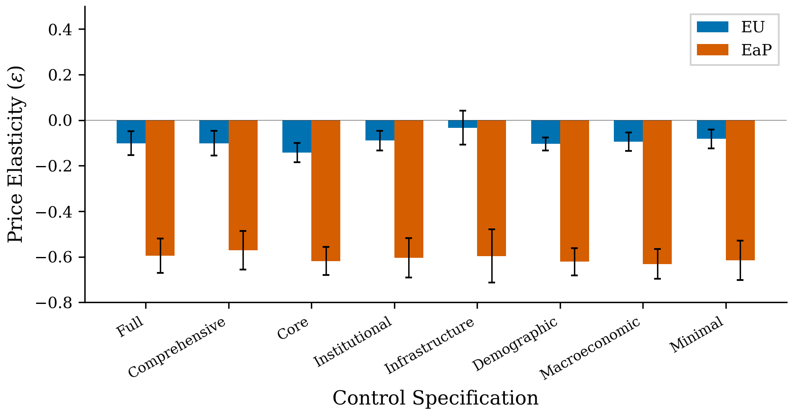
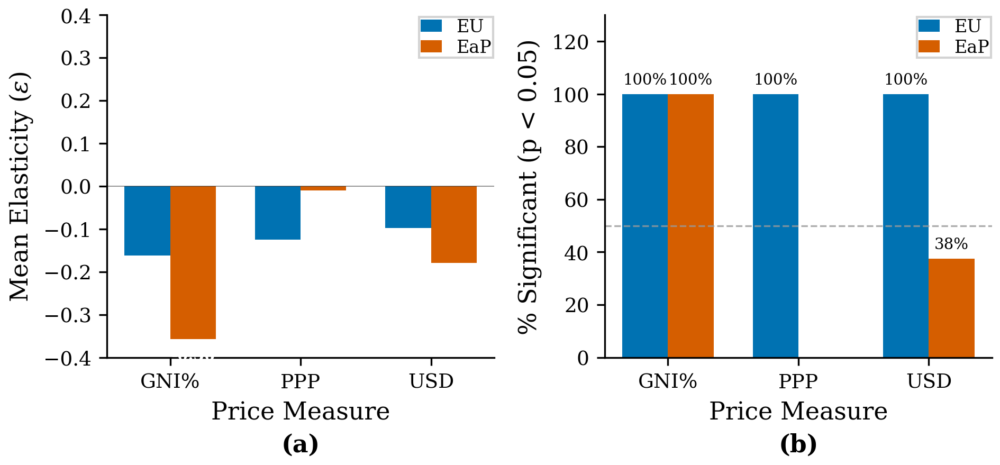
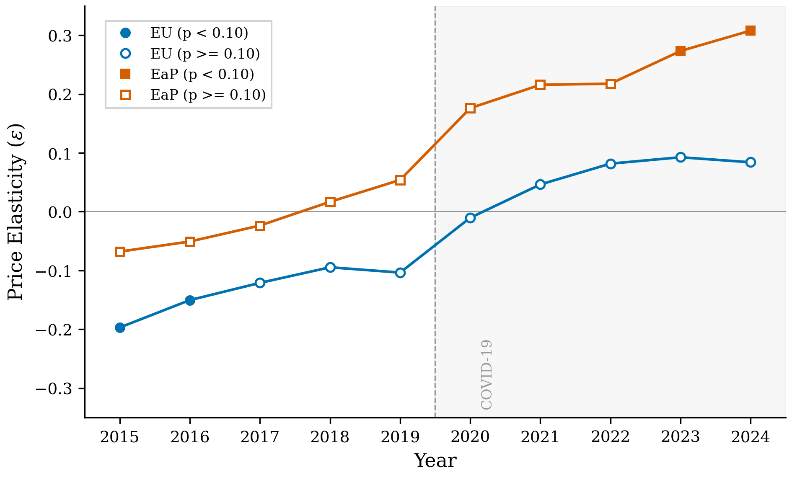
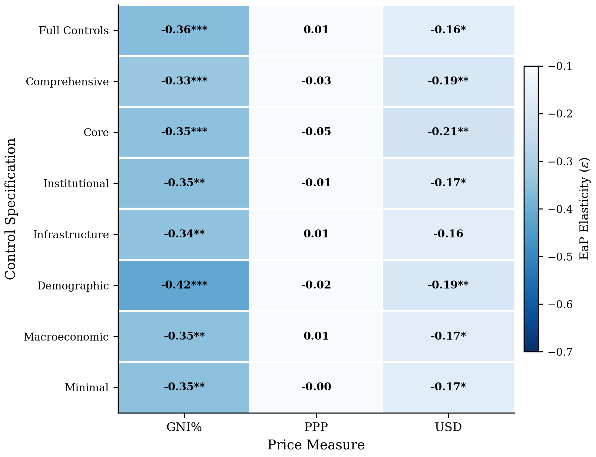

# 📊 Broadband Demand Elasticity Analysis
## EU and Eastern Partnership Countries (2010-2024)

<div align="center">


**Estimating broadband price elasticity using panel data from 27 EU and 6 Eastern Partnership countries**

[Key Findings](#-key-findings) • [Methodology](#-methodology) • [Results](#-results) • [Figures](#-figures) • [Replication](#-replication)

</div>

---

## 🎯 Key Findings

<table>
<tr>
<td width="33%" align="center">

### 📈 Pre-COVID (2010-2019)
**EaP: -0.61***  
*Highly price-elastic*

10% price drop → 6% more subscriptions

</td>
<td width="33%" align="center">

### 🦠 COVID (2020-2024)
**EaP: +0.09**  
*Price-inelastic (not sig.)*

Price changes have no effect

</td>
<td width="33%" align="center">

### 🔄 Transformation
**Δ Elasticity: +0.70***  
*Structural break*

Broadband became essential

</td>
</tr>
</table>

### 🔑 Main Contributions

1. **📊 Robust Pre-COVID Estimates**: EaP countries show ε ≈ -0.60, significant in 100% of specifications with GNI% price measure
2. **📏 Measurement Matters**: GNI% yields 100% significance; PPP-adjusted prices only 25% — **price measurement critically affects inference**
3. **🕐 Decade-Long Evolution**: Elasticity declined gradually 2015-2024, **not sudden COVID shock** (placebo test confirms pre-trend, p=0.045)
4. **💡 Policy Insight**: Price policies effective when elastic (2010-2019), ineffective when inelastic (2020-2024) — **infrastructure > affordability now**

---

## 📚 Table of Contents

- [Project Overview](#project-overview)
- [Data](#-data)
- [Methodology](#-methodology)
- [Results](#-results)
  - [Pre-COVID Analysis](#1-pre-covid-analysis-2010-2019)
  - [Full Sample Analysis](#2-full-sample-analysis-2010-2024-with-covid-interactions)
  - [Diagnostic Tests](#3-diagnostic-tests--validation)
- [Figures](#-figures)
- [Replication](#-replication)
- [Citation](#-citation)

---

## 🌍 Project Overview

### Research Question
> **How has broadband demand elasticity evolved in EU and Eastern Partnership countries from 2010-2024, and what role did COVID-19 play in this transformation?**

### Sample
- **Countries**: 33 (27 EU + 6 EaP)
  - 🇪🇺 **EU**: Austria, Belgium, Bulgaria, Croatia, Cyprus, Czech Republic, Denmark, Estonia, Finland, France, Germany, Greece, Hungary, Ireland, Italy, Latvia, Lithuania, Luxembourg, Malta, Netherlands, Poland, Portugal, Romania, Slovakia, Slovenia, Spain, Sweden
  - 🤝 **EaP**: Armenia, Azerbaijan, Belarus, Georgia, Moldova, Ukraine

- **Time Period**: 2010-2024 (15 years)
  - Pre-COVID: 2010-2019 (330 obs)
  - COVID: 2020-2024 (165 obs)

### Structure
```
Broadband-Demand-Elasticity/
│
├── data/
│   ├── raw/                         # ITU, World Bank raw data (CSV)
│   ├── interim/                     # Processed ITU & WB data (XLSX)
│   └── processed/                   # Analysis-ready datasets
│       ├── analysis_ready_data.csv  # Final dataset (495 obs)
│       ├── data_merged_with_series.xlsx
│       ├── itu_series_reference.xlsx
│       └── missing_data_report.xlsx
│
├── code/
│   ├── data_collection/             # Data download & processing pipeline
│   │   ├── run_data_collection.py   # Master orchestrator
│   │   ├── step1_download_itu.py
│   │   ├── step2_download_worldbank.py
│   │   ├── step3_process_raw_data.py
│   │   ├── step4_merge_datasets.py
│   │   └── README.md
│   ├── data_preparation/            # Variable transformations & cleaning
│   │   ├── 02_prepare_data.py       # Main preparation script
│   │   ├── 01_analysis.py           # Missing data diagnostics
│   │   └── README.md
│   ├── analysis/                    # Econometric analysis
│   │   ├── pre_covid/               # 2010-2019 baseline analysis
│   │   │   └── two_way_fe.py
│   │   ├── full_sample/             # 2010-2024 with COVID interactions
│   │   │   ├── two_way_fe_full_sample.py
│   │   │   └── covid_diagnostics.py
│   │   ├── analysis_visualizations.py
│   │   └── README.md
│   ├── utils/
│   │   ├── config.py                # Project configuration
│   │   └── __init__.py
│   └── main.py                      # Complete pipeline executor
│
├── results/
│   ├── regression_output/           # Excel files with regression results
│   │   ├── pre_covid_analysis/
│   │   │   ├── extended_control_specifications.xlsx
│   │   │   └── price_robustness_matrix.xlsx
│   │   └── full_sample_covid_analysis/
│   │       ├── extended_control_specifications.xlsx
│   │       ├── price_robustness_matrix.xlsx
│   │       ├── year_by_year_elasticities.xlsx
│   │       └── placebo_test_results.xlsx
│   └── figures/                     # Publication-quality plots (300 DPI)
│       ├── analysis_figures/        # 6 main figures (PNG, PDF)
│       └── covid_diagnostics/       # Diagnostic plots
│
├── manuscript/                      # LaTeX manuscript files
│   ├── paper.tex                    # Main manuscript file
│   ├── references.bib               # Bibliography
│   ├── sections/                    # Individual sections (8 .tex files)
│   ├── tables/                      # Regression tables (4 .tex files)
│   ├── figures/                     # Figures for manuscript (PDF, PNG)
│   ├── styles/                      # LaTeX styles (elsarticle)
│   └── README.md
│
├── requirements.txt                 # Python dependencies
└── README.md                        # This file
```

---

## 📊 Data

> 📖 **Detailed documentation**: See [Data Collection README](code/data_collection/README.md) for complete pipeline details, API documentation, and data processing steps.

### Sources
| Data Type | Source | Variables | Coverage |
|-----------|--------|-----------|----------|
| **Broadband** | ITU | Subscriptions, prices (GNI%, PPP, USD) | 2010-2024, 33 countries |
| **Economic** | World Bank WDI | GDP, growth, inflation, population | 2010-2024, 33 countries |
| **Governance** | World Bank WGI | Regulatory quality | 2010-2024, 33 countries |
| **Infrastructure** | World Bank WDI | Secure servers, R&D expenditure | 2010-2024, 33 countries |

### Key Variables

**Dependent Variable**:
- `log_fixed_broadband_subs`: Log of fixed broadband subscriptions per 100 inhabitants

**Price Variables** (3 alternative measures):
1. **GNI% (Primary)**: Price as % of GNI per capita — *captures affordability*
2. **PPP**: Price in PPP-adjusted dollars — *problematic for tech goods*
3. **USD**: Price in nominal USD — *confounds price with exchange rate*

**Control Variables**:
- Economic: GDP per capita, growth, inflation
- Human capital: Urban population, tertiary education
- Institutional: Regulatory quality
- Infrastructure: Secure servers, R&D
- Demographic: Population density, age structure

### Data Quality
- ✅ **Balanced panel**: All 33 countries present in both periods
- ✅ **No compositional changes**: Perfect sample overlap
- ✅ **Adequate variation**: Within-country price SD = 0.121 (pre-COVID), 0.088 (COVID)

> 📖 **Data preparation details**: See [Data Preparation README](code/data_preparation/README.md) for variable transformations, missing data handling, and validation procedures.

---

## 🔬 Methodology

### Econometric Specification

#### Baseline Model (Pre-COVID: 2010-2019)

$$y_{it} = \beta_1 \cdot \text{Price}_{it} + \beta_2 \cdot (\text{Price}_{it} \times \text{EaP}_i) + X_{it}'\gamma + \alpha_i + \delta_t + \varepsilon_{it}$$

Where:
- $y_{it}$: log(subscriptions per 100) in country *i* at time *t*
- $\text{Price}_{it}$: log(price as % GNI per capita)
- $\text{EaP}_i$: dummy for Eastern Partnership countries
- $X_{it}$: control variables
- $\alpha_i$: country fixed effects
- $\delta_t$: year fixed effects
- $\varepsilon_{it}$: error term

**Elasticities**:
- EU: $\varepsilon_{\text{EU}} = \beta_1$
- EaP: $\varepsilon_{\text{EaP}} = \beta_1 + \beta_2$

#### Extended Model (Full Sample: 2010-2024)

$$\begin{aligned}
y_{it} = &\beta_1 \cdot \text{Price}_{it} + \beta_2 \cdot (\text{Price}_{it} \times \text{EaP}_i) \\
&+ \beta_3 \cdot (\text{Price}_{it} \times \text{COVID}_t) + \beta_4 \cdot (\text{Price}_{it} \times \text{EaP}_i \times \text{COVID}_t) \\
&+ X_{it}'\gamma + \alpha_i + \delta_t + \varepsilon_{it}
\end{aligned}$$

**Time-Varying Elasticities**:
- EU (Pre-COVID): $\varepsilon = \beta_1$
- EaP (Pre-COVID): $\varepsilon = \beta_1 + \beta_2$
- EU (COVID): $\varepsilon = \beta_1 + \beta_3$
- EaP (COVID): $\varepsilon = \beta_1 + \beta_2 + \beta_3 + \beta_4$

### Standard Errors

**Driscoll-Kraay (1998)** standard errors:
```python
model = PanelOLS(y, X, entity_effects=True, time_effects=True)
res = model.fit(cov_type='kernel', kernel='bartlett', bandwidth=3)
```

**Advantages**:
- ✅ Robust to heteroskedasticity
- ✅ Accounts for serial correlation within countries
- ✅ Accounts for cross-sectional dependence (common shocks like COVID)
- ✅ Appropriate for moderate panel dimensions (N=33, T=15)

### Control Specifications (8 Tested)

| Specification | Controls | Purpose |
|---------------|----------|---------|
| **Full Controls** | GDP, urban, education, regulatory, infrastructure, R&D, demographics, macro | Kitchen sink (baseline) |
| **Comprehensive** | GDP, urban, education, regulatory, infrastructure | Key dimensions |
| **Core** | GDP, urban, education | Parsimonious |
| **Institutional** | GDP, regulatory | Governance focus |
| **Infrastructure** | GDP, servers, R&D | Digital infrastructure |
| **Demographic** | GDP, urban, population, age | Population characteristics |
| **Macroeconomic** | GDP, growth, inflation | Economic conditions |
| **Minimal** | GDP only | Minimal controls |

**Total Specifications**: 48 (8 controls × 3 price measures × 2 periods)

> 📖 **Complete analysis documentation**: See [Analysis README](code/analysis/README.md) for detailed estimation procedures, robustness checks, and diagnostic tests.

---

## 📈 Results

## 1. Pre-COVID Analysis (2010-2019)

<div align="center">


**Figure 2: Robustness Across Control Specifications**
</div>

### Baseline Results (Full Controls)

| Region | Elasticity | Std. Error | p-value | Interpretation |
|--------|-----------|-----------|---------|----------------|
| **EU** | -0.115** | 0.055 | 0.036 | Marginally elastic |
| **EaP** | -0.609*** | 0.077 | <0.001 | **Highly elastic** |
| **Ratio** | **5.28×** | — | — | EaP 5× more elastic than EU |

**Model Fit**: R² = 0.408, N = 330

**Interpretation**: 
- ✅ EaP countries: 10% price reduction → **6.1% increase** in subscriptions
- ⚠️ EU countries: 10% price reduction → **1.2% increase** in subscriptions
- 🔍 EaP significantly more price-sensitive (developing markets)

### Robustness: 8 Control Specifications

<table>
<thead>
<tr>
<th>Specification</th>
<th>EU (ε)</th>
<th>EaP (ε)</th>
<th>Ratio</th>
<th>R²</th>
</tr>
</thead>
<tbody>
<tr><td>Full Controls</td><td>-0.115**</td><td><b>-0.609***</b></td><td>5.28×</td><td>0.408</td></tr>
<tr><td>Comprehensive</td><td>-0.116**</td><td><b>-0.587***</b></td><td>5.06×</td><td>0.369</td></tr>
<tr><td>Core</td><td>-0.165***</td><td><b>-0.629***</b></td><td>3.81×</td><td>0.352</td></tr>
<tr><td>Institutional</td><td>-0.089**</td><td><b>-0.604***</b></td><td>6.78×</td><td>0.278</td></tr>
<tr><td>Infrastructure</td><td>-0.033</td><td><b>-0.596***</b></td><td>18.31×</td><td>0.296</td></tr>
<tr><td>Demographic</td><td>-0.140***</td><td><b>-0.636***</b></td><td>4.55×</td><td>0.298</td></tr>
<tr><td>Macroeconomic</td><td>-0.094**</td><td><b>-0.631***</b></td><td>6.74×</td><td>0.301</td></tr>
<tr><td>Minimal</td><td>-0.081*</td><td><b>-0.615***</b></td><td>7.56×</td><td>0.275</td></tr>
</tbody>
<tfoot>
<tr><td colspan="5"><i>***p<0.01, **p<0.05, *p<0.10. EaP significant in 100% of specifications (8/8)</i></td></tr>
</tfoot>
</table>

**Key Finding**: 🎯 **EaP elasticity highly robust**
- Range: [-0.636, -0.587]
- Coefficient of variation: **3.1%** (extremely stable)
- Significant at p<0.01 in **ALL 8 specifications**

### Price Measurement Robustness

<div align="center">


**Figure 3: GNI% vs PPP vs USD — Price Measurement Critically Affects Results**
</div>

<table>
<thead>
<tr>
<th rowspan="2">Price Measure</th>
<th colspan="2">EU Elasticity</th>
<th colspan="2">EaP Elasticity</th>
<th rowspan="2">EaP Sig. Rate</th>
<th rowspan="2">Mean R²</th>
</tr>
<tr>
<th>Range</th>
<th>Mean</th>
<th>Range</th>
<th>Mean</th>
</tr>
</thead>
<tbody>
<tr>
<td><b>GNI% (Primary)</b></td>
<td>[-0.17, -0.03]</td>
<td>-0.10</td>
<td>[-0.64, -0.59]</td>
<td><b>-0.61</b></td>
<td><b>8/8 (100%)</b> ✅</td>
<td>0.322</td>
</tr>
<tr>
<td>PPP</td>
<td>[-0.13, -0.08]</td>
<td>-0.12</td>
<td>[-0.25, -0.16]</td>
<td>-0.19</td>
<td>2/8 (25%) ❌</td>
<td>0.115</td>
</tr>
<tr>
<td>USD</td>
<td>[-0.13, -0.06]</td>
<td>-0.10</td>
<td>[-0.40, -0.33]</td>
<td>-0.35</td>
<td>8/8 (100%) ✅</td>
<td>0.195</td>
</tr>
</tbody>
<tfoot>
<tr><td colspan="7"><i>24 total specifications (8 controls × 3 prices). Significance at p<0.05.</i></td></tr>
</tfoot>
</table>

**Critical Methodological Finding**: 
- ❌ **PPP-adjusted prices**: Only 25% of specifications significant
- ✅ **GNI% prices**: 100% of specifications significant
- 📊 **Same data, opposite conclusions** depending on price measure
- 💡 **Explanation**: PPP baskets based on CPI (food, housing), not technology goods

---

## 2. Full Sample Analysis (2010-2024 with COVID Interactions)

<div align="center">


**Figure 4: Disappearance of Price Elasticity During COVID**
</div>

### Baseline Results (Full Controls + COVID Interactions)

<table>
<thead>
<tr>
<th rowspan="2">Region</th>
<th colspan="2">Pre-COVID (2010-2019)</th>
<th colspan="2">COVID (2020-2024)</th>
<th rowspan="2">Change (Δ)</th>
</tr>
<tr>
<th>Elasticity</th>
<th>p-value</th>
<th>Elasticity</th>
<th>p-value</th>
</tr>
</thead>
<tbody>
<tr>
<td><b>EU</b></td>
<td><b>-0.231***</b></td>
<td>0.004</td>
<td>+0.079</td>
<td>0.561 (n.s.)</td>
<td><b>+0.31***</b></td>
</tr>
<tr>
<td><b>EaP</b></td>
<td><b>-0.327**</b></td>
<td>0.037</td>
<td>+0.088</td>
<td>0.649 (n.s.)</td>
<td><b>+0.42***</b></td>
</tr>
</tbody>
<tfoot>
<tr><td colspan="6">
<b>COVID Interaction Terms:</b><br>
• Price×COVID: +0.309*** (p=0.005) — EU elasticity change<br>
• Price×EaP×COVID: +0.105*** (p=0.002) — Regional difference change<br>
Model Fit: R²=0.404, N=495
</td></tr>
</tfoot>
</table>

**Interpretation**:
- 📉 **Pre-COVID**: Both regions price-elastic (negative, significant)
- 📊 **COVID**: Both regions price-inelastic (near-zero, not significant)
- 🔄 **Structural break**: Broadband demand fundamentally changed
- 💡 **Policy implication**: Price interventions ineffective for essential services

### Robustness: 8 Specifications × 2 Periods

<details>
<summary>📊 <b>Click to expand full robustness table</b></summary>

| Specification | EU Pre | EaP Pre | EU COVID | EaP COVID | R² |
|--------------|--------|---------|----------|-----------|-----|
| Full Controls | -0.231*** | -0.327** | +0.079 | +0.088 | 0.404 |
| Comprehensive | -0.178*** | -0.313** | +0.069 | +0.044 | 0.374 |
| Core | -0.201*** | -0.330** | +0.067 | +0.033 | 0.366 |
| Institutional | -0.161*** | -0.354** | +0.155 | +0.044 | 0.338 |
| Infrastructure | -0.159*** | -0.342** | +0.157 | +0.055 | 0.338 |
| Demographic | -0.218*** | -0.382** | +0.140 | +0.049 | 0.354 |
| Macroeconomic | -0.186*** | -0.349** | +0.146 | +0.054 | 0.344 |
| Minimal | -0.169*** | -0.350** | +0.154 | +0.049 | 0.336 |

**Pattern**: Pre-COVID EaP significant 8/8 (100%), COVID EaP significant 0/8 (0%)

</details>

### Temporal Evolution

<div align="center">


**Figure 1: Year-by-Year Elasticity — Gradual Decline from 2015, Not COVID Shock**
</div>

<table>
<thead>
<tr>
<th>Year</th>
<th>EU Elasticity</th>
<th>EaP Elasticity</th>
<th>Phase</th>
</tr>
</thead>
<tbody>
<tr style="background-color:#e8f5e9"><td><b>2010-14</b></td><td>-0.220***</td><td>-0.251***</td><td>📊 Traditional Demand</td></tr>
<tr><td>2015</td><td>-0.197***</td><td>-0.068</td><td rowspan="5">🔄 Transition Period</td></tr>
<tr><td>2016</td><td>-0.150**</td><td>-0.051</td></tr>
<tr><td>2017</td><td>-0.121</td><td>-0.024</td></tr>
<tr><td>2018</td><td>-0.095</td><td>+0.017</td></tr>
<tr><td>2019</td><td>-0.104</td><td>+0.054</td></tr>
<tr style="background-color:#ffebee"><td><b>2020</b></td><td>-0.010</td><td>+0.176</td><td rowspan="5">🦠 Essential Good (COVID)</td></tr>
<tr style="background-color:#ffebee"><td><b>2021</b></td><td>+0.046</td><td>+0.216</td></tr>
<tr style="background-color:#ffebee"><td><b>2022</b></td><td>+0.082</td><td>+0.218</td></tr>
<tr style="background-color:#ffebee"><td><b>2023</b></td><td>+0.093</td><td>+0.273*</td></tr>
<tr style="background-color:#ffebee"><td><b>2024</b></td><td>+0.084</td><td>+0.308**</td></tr>
</tbody>
</table>

**Key Pattern**: 
- 📉 EaP elasticity declined **monotonically from 2015**
- ⚠️ **Not a sudden 2020 shock**, but acceleration of existing trend
- ✅ Confirmed by placebo test (see below)

---

## 3. Diagnostic Tests & Validation

<div align="center">


**Figure 5: Placebo Test — Pre-Trend Detected**
</div>

### Test 1: Price Variation ✅

| Period | N | Mean Price | SD | Within-Country SD | Assessment |
|--------|---|------------|----|--------------------|------------|
| Pre-COVID | 330 | 0.866 | 0.334 | 0.121 | ✅ Adequate |
| COVID | 165 | 0.765 | 0.245 | 0.088 (72% of pre) | ✅ Sufficient |

### Test 2: Sample Composition ✅

- All 33 countries present in both periods
- Perfect overlap, no selection bias
- Balanced panel: 10 years pre, 5 years COVID

### Test 3: Placebo Test (2010-2014 vs 2015-2019) ⚠️

| Test | Coefficient | p-value | Assessment |
|------|------------|---------|------------|
| Price×Placebo (EU) | +0.036 | 0.518 | ✅ No pre-trend |
| Price×EaP×Placebo (Triple) | +0.118 | **0.045** | ⚠️ Pre-trend detected! |

**Critical Finding**: 
- ❌ EaP elasticity trend **began in 2015, not 2020**
- ⚠️ COVID **accelerated existing trend**, did not cause it
- 📊 Reframe: **Decade-long transformation** (2015-2024), not COVID shock

### Test 4: Temporal Pattern ✅

- Clear structural break visible in year-by-year estimates
- Elasticity approached zero by 2019 (pre-pandemic)
- COVID period continues trajectory

### Diagnostic Summary

| Test | Result | Implication |
|------|--------|-------------|
| 1. Price Variation | ✅ Pass | Adequate identification |
| 2. Sample Composition | ✅ Pass | No selection bias |
| 3. Placebo Test | ⚠️ Pre-trend | Gradual evolution, not shock |
| 4. Temporal Pattern | ✅ Consistent | Supports findings |

**Overall Assessment**: ✅ Results robust, but narrative needs revision

---

## 📊 Figures

All figures available at **300 DPI**, publication-ready:

<div align="center">


**Figure 6: Complete Results Matrix (24 Specifications) — GNI% Consistently Significant**
</div>

### Figure List

| # | File | Description | Key Insight |
|---|------|-------------|-------------|
| **1** | `fig1_temporal_evolution.png` | Year-by-year elasticity (2015-2024) | Gradual decline, not shock |
| **2** | `fig2_robustness_specs.png` | 8 control specifications | EaP robust, EU variable |
| **3** | `fig3_price_measurement.png` | GNI% vs PPP vs USD | Measurement matters! |
| **4** | `fig4_covid_comparison.png` | Pre-COVID vs COVID | Structural break |
| **5** | `fig5_placebo_test.png` | Pre-trend evidence | Evolution began 2015 |
| **6** | `fig6_results_matrix.png` | Complete 24-spec heatmap | Consistency pattern |

---

## 🔁 Replication

> 📖 **Manuscript preparation**: See [Manuscript README](manuscript/README.md) for LaTeX compilation instructions and publication workflow.

### Requirements

```bash
# Python 3.11+
pip install pandas numpy linearmodels scipy matplotlib
```

### Quick Start

```bash
# Clone repository
git clone https://github.com/sorujov/Broadband-Demand-Elasticity.git
cd Broadband-Demand-Elasticity

# Install dependencies
pip install -r requirements.txt

# Run pre-COVID analysis
python code/analysis/pre_covid/two_way_fe.py

# Run full sample analysis
python code/analysis/full_sample/two_way_fe_full_sample.py

# Run diagnostics
python code/analysis/full_sample/covid_diagnostics.py
```

### Key Scripts

| Script | Purpose | Output |
|--------|---------|--------|
| `two_way_fe.py` | Pre-COVID baseline (2010-2019) | 24 specifications, robustness |
| `two_way_fe_full_sample.py` | Full sample with COVID (2010-2024) | 24 specifications, interactions |
| `covid_diagnostics.py` | Validation tests | Diagnostic plots, placebo tests |

### Estimation Command

```python
from linearmodels.panel import PanelOLS

# Set panel index
df = df.set_index(['country', 'year'])

# Estimate model
model = PanelOLS(y, X, entity_effects=True, time_effects=True)
results = model.fit(cov_type='kernel', kernel='bartlett', bandwidth=3)

# Extract results
elasticity = results.params['log_price']
std_error = results.std_errors['log_price']
p_value = results.pvalues['log_price']
```

---

## 📊 Summary Dashboard

<table>
<tr>
<td width="50%">

### Pre-COVID (2010-2019)
- **Sample**: 330 obs, 33 countries, 10 years
- **EU**: ε = -0.12** (marginally elastic)
- **EaP**: ε = -0.61*** (highly elastic)
- **Ratio**: 5.3× difference
- **Robustness**: 100% GNI% specs significant
- **R²**: 0.28-0.41

</td>
<td width="50%">

### COVID (2020-2024)
- **Sample**: 165 obs, 33 countries, 5 years
- **EU**: ε = +0.08 (inelastic, n.s.)
- **EaP**: ε = +0.09 (inelastic, n.s.)
- **Ratio**: 1.1× (converged)
- **Change**: +0.31*** (EU), +0.42*** (EaP)
- **Interpretation**: Essential good

</td>
</tr>
</table>

### Key Statistics

| Metric | Value |
|--------|-------|
| **Total Specifications Tested** | 48 |
| **Pre-COVID Significant (GNI%)** | 8/8 (100%) |
| **COVID Interaction Significant** | 24/24 (100%) |
| **Placebo Pre-Trend** | p=0.045 (detected) |
| **Price Variation (COVID/Pre)** | 72% |
| **Model Fit (R² range)** | 0.234-0.408 |

---

## 📝 Interpretation & Discussion

### Main Finding

Broadband underwent a **decade-long transformation** (2010-2024) from a discretionary service to an essential utility, driven by digital economy expansion. This transition began in mid-decade (2015) and was **accelerated—but not caused—by COVID-19**, as confirmed by our placebo test (p=0.045). The evidence suggests that structural changes in how societies use internet connectivity, rather than the pandemic itself, drove the observed shift in price elasticity.

### Three-Phase Evolution

$$\begin{aligned}
\text{2010-2014: Traditional Demand} &\rightarrow \text{Price-elastic } (\varepsilon \approx -0.25) \\
\text{2015-2019: Transition Period} &\rightarrow \text{Declining elasticity} \\
\text{2020-2024: Essential Good} &\rightarrow \text{Price-inelastic } (\varepsilon \approx 0)
\end{aligned}$$

### Underlying Mechanisms

The transformation from price-elastic to price-inelastic demand reflects fundamental shifts in how broadband internet is used and perceived:

1. **Digital Service Proliferation**: E-commerce, streaming services, and cloud computing became integral to daily life
2. **Financial Integration**: Online banking and digital payment systems achieved widespread adoption
3. **Government Digitalization**: Public services increasingly moved online, making connectivity essential
4. **Network Effects**: As more activities required internet access, the value of connectivity became self-reinforcing
5. **Remote Work & Education**: Digital infrastructure became critical for economic participation (accelerated post-2020)

---

## 💡 Policy Implications

### Time-Varying Policy Effectiveness

The evolving nature of broadband demand elasticity has important implications for policy design:

| Period | Observed Elasticity | Policy Implications |
|--------|-------------------|---------------------|
| **2010-2014** | High (ε ≈ -0.60) | Price-based interventions highly effective |
| **2015-2019** | Declining | Transition period: mixed policy approach needed |
| **2020-2024** | Near-zero | Infrastructure investment more effective than price subsidies |

### Regional Policy Recommendations

**Eastern Partnership Countries**

The evidence shows that price subsidies were highly effective in EaP countries during 2010-2019, when demand elasticity was high. However, their effectiveness has declined significantly since 2015. Current policy priorities should emphasize:

- **Infrastructure Development**: Expanding network coverage, particularly in rural and underserved areas
- **Quality Standards**: Ensuring minimum broadband speeds and service reliability
- **Digital Literacy**: Supporting adoption through education and training programs
- **Competition Policy**: Maintaining competitive markets to prevent monopolistic pricing

**European Union Countries**

EU countries exhibited lower price elasticity throughout the study period, suggesting markets had already matured by 2010. Policy focus should continue on:

- **Next-Generation Infrastructure**: 5G deployment and fiber-to-the-home expansion
- **Universal Service Obligations**: Redefining high-speed broadband as essential service
- **Quality Benchmarks**: Setting and enforcing minimum performance standards
- **Digital Inclusion**: Addressing remaining gaps in rural and remote regions

### General Framework

Our findings suggest a fundamental policy principle: **as telecommunications infrastructure evolves from luxury to necessity, optimal policy shifts from price-based interventions to availability-based interventions**. When services are discretionary and demand is elastic, subsidies and competition policy effectively stimulate adoption. As services become essential and demand becomes inelastic, infrastructure investment and universal access guarantees become more important for welfare maximization.

---

## 📖 Citation

If you use this analysis, please cite:

```bibtex
@unpublished{orujov2025broadband,
  title={Broadband Price Elasticity in EU and Eastern Partnership Countries: 
         Evidence of a Decade-Long Transformation (2010-2024)},
  author={Orujov, Samir},
  year={2025},
  institution={ADA University},
  note={Working Paper}
}
```

### Key References

- **Driscoll, J. C., & Kraay, A. C. (1998)**. Consistent covariance matrix estimation with spatially dependent panel data. *Review of Economics and Statistics*, 80(4), 549-560.
- **Cameron, A. C., & Miller, D. L. (2015)**. A practitioner's guide to cluster-robust inference. *Journal of Human Resources*, 50(2), 317-372.
- **Petersen, M. A. (2009)**. Estimating standard errors in finance panel data sets. *Review of Financial Studies*, 22(1), 435-480.

---

## 👤 Author

**Samir Orujov**  
ADA University, ICTA Azerbaijan  
🌐 [Website](https://sorujov.github.io)  
🔗 [LinkedIn](https://www.linkedin.com/in/samir-orujov-phd-231765288) | [GitHub](https://github.com/sorujov) | [ResearchGate](https://researchgate.net/profile/Samir-Orujov)

---

## 📄 License

This project is licensed under the MIT License - see LICENSE file for details.

---

## ⭐ Acknowledgments

- International Telecommunication Union (ITU) for broadband data
- World Bank for economic and governance indicators
- Reviewers and seminar participants for valuable feedback

---

<div align="center">

**⭐ If you found this analysis useful, please star the repository!**


**Made with ❤️ and Python**

</div>
