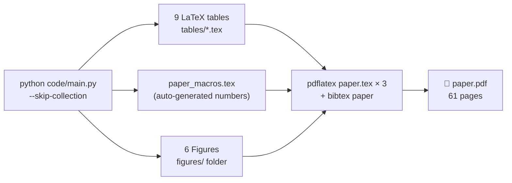

# Manuscript — LaTeX Source

This folder contains the complete LaTeX source for the manuscript, organized to compile cleanly with relative paths and Elsevier's `elsarticle` class.

## Build Flowchart



> **Important:** Always run `python code/main.py --skip-collection` first to regenerate tables and macros before compiling.

---

## Directory Structure

```
manuscript/
├── paper.tex              # Main manuscript (inputs all sections/tables)
├── references.bib         # Bibliography database
├── paper_macros.tex       # Auto-generated result macros (do not edit manually)
│
├── sections/              # Section files (input via \input{sections/<name>})
│   ├── abstract.tex
│   ├── introduction.tex
│   ├── literature.tex
│   ├── data.tex
│   ├── methodology.tex
│   ├── results.tex
│   ├── discussion.tex
│   └── conclusion.tex
│
├── tables/                # Regression tables (9 files, auto-generated)
│   ├── table1_baseline.tex          # Pre-COVID baseline (Table 1)
│   ├── table2_covid.tex             # Full-sample COVID interactions (Table 2)
│   ├── table3_price_robustness.tex  # 24-spec price robustness (Table 3)
│   ├── table4_placebo.tex           # Placebo pre-trend test (Table 4)
│   ├── table5_period_split.tex      # Period split analysis (Table 5)
│   ├── table6_iv_robustness.tex     # IV / 2SLS estimates (Table 6)
│   ├── table7_jackknife.tex         # EaP jackknife by country (Table 7)
│   ├── table8_sample_restrictions.tex # Sample restriction robustness (Table 8)
│   └── table_descriptives.tex       # Descriptive statistics
│
├── figures/               # Publication figures (copied from results/figures/)
├── styles/                # Elsevier document class and bibliography style
│   ├── elsarticle.cls
│   └── elsarticle-harv.bst
```

---

## Compile Instructions

Run from this folder:

```bash
pdflatex -interaction=nonstopmode paper.tex
bibtex paper
pdflatex -interaction=nonstopmode paper.tex
pdflatex -interaction=nonstopmode paper.tex
```

Three `pdflatex` passes are required to resolve all cross-references.

---

## Notes

- `\graphicspath{{figures/}}` ensures all figures load from `manuscript/figures/`.
- `\input{paper_macros}` loads auto-generated result macros — numbers in the manuscript body update automatically when the pipeline is re-run.
- All section files are input via `\input{sections/<name>}`.
- All table files are input via `\input{tables/<name>}`.
- The `figures/` folder must be present when sharing or archiving the source.
- Journal target: *Information Economics and Policy* (Elsevier, `elsarticle` class).
